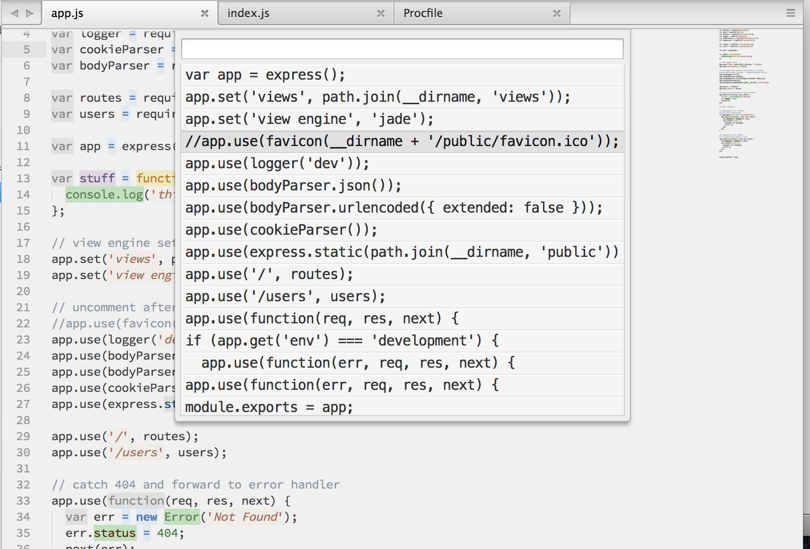

# sublime-occur

Emacs' `M-x occur` for Sublime Text 3

Find all occurrences of a given piece of text in the current file, easily.

## Screenshot

After entering `app.` as the pattern to search for:

## How to install

(Mac only at the moment; sorry, it's what I have. Please feel free to submit a PR against this README file and I'll merge.)

1. `Sublime Menu > Preferences > Browse Packages ...`
2. Open up Terminal.app (or iTerm2.app, or whatever you use)
3. Type `cd `, drag the little folder at the top of the Finder window you just opened onto your terminal, and hit `[Enter]`
4. Type `git clone https://github.com/dreki/sublime-occur` and hit `[Enter]`

## Usage notes

Bring up the Command Palette and type 'occur'. You should then see something like 'Occur: Find occurrences in file ...'. Hit enter and you'll be prompted to enter a **regex** pattern (treated as **case-insensitive**). Hit enter, and you'll be presented with your results in a panel. As you move up and down the list, the result will be scrolled into view (in the center of the screen, if possible). When you hit enter, the selected result will be visible and the results panel will disappear.

Please note that at the current time (2015-03-23), when no results are found, the results panel simply doesn't show up.
